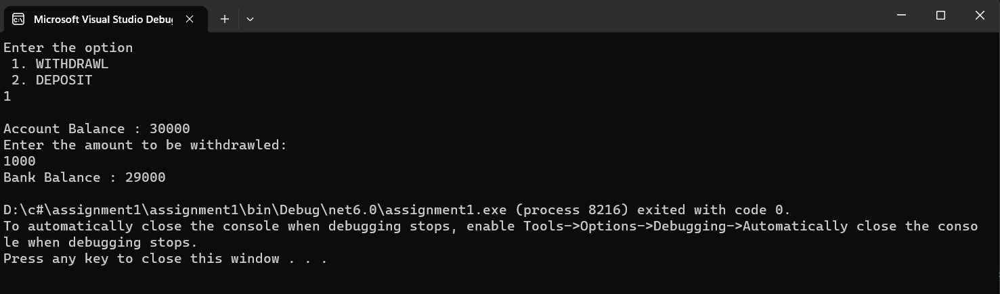
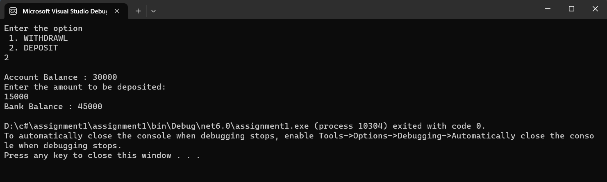

## Interface

## Aim:
To write a C# program using interface concept.
## Algorithm:
## Step 1:
Create an interface.

## Step 2:
Create a child class.

## Step 3:
Declare 2 functions deposit() and withdrawal() as abstract methods in the interface.

## Step 4:
Create those 2 functions in the child class and perform respective operation.

## Step 5:
Use while loop and and switch case to Get the choice from the user whether to perform withdrawal or deposit operation.

## Step 6:
After performing the functions display the remaining balance of the use.

## Program:
```
using System;
using System.Reflection.Metadata.Ecma335;

namespace abhi
{

    public interface bank
    {
        public int deposit(int amount);
        public int withd(int amount);


    }
    public class Program : bank
    {
        public int amount, amt = 30000;
        public int deposit(int amount)
        {
            this.amount = amount;
            return amt + amount;

        }
        public int withd(int amount)
        {
            this.amount = amount;
            return amt - amount;

        }
        public static void Main(string[] args)
        {


            Program b = new Program();
            Console.WriteLine("Enter the option \n 1. WITHDRAWL \n 2. DEPOSIT");
            int a = Convert.ToInt32(Console.ReadLine());
            Console.WriteLine("\nAccount Balance : " + b.amt);
            if (a == 1)
            {
                Console.WriteLine("Enter the amount to be withdrawled:");
                b.amount = Convert.ToInt32(Console.ReadLine());
                int c = b.withd(b.amount);
                Console.WriteLine("Bank Balance : " + c);

            }
            if (a == 2)
            {
                Console.WriteLine("Enter the amount to be deposited:");
                b.amount = Convert.ToInt32(Console.ReadLine());
                int d = b.deposit(b.amount);
                Console.WriteLine("Bank Balance : " + d);

            }

        }
    }
}
```
## Output:



## Result:
Thus the C# program using interface concept has been implemented successfully.